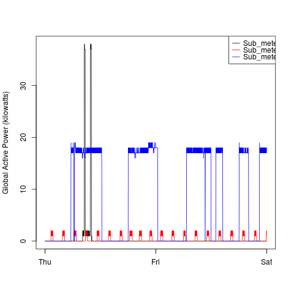
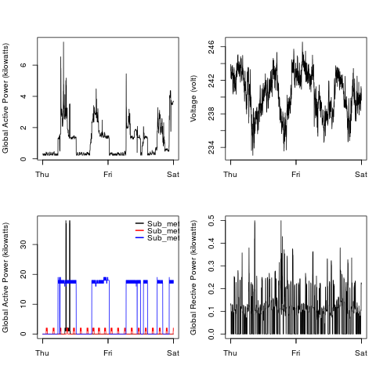

# [Coursera Exploratory Data Analysis](https://www.coursera.org/learn/exploratory-data-analysis/) - Week 1 Assignment

## Objective

The objective of this assignment is to emulate four different graphs, stored in the [`figure/`](https://github.com/pespeso/04_ExData-W1_assignment/tree/master/figure) folder. To do so, here is the followed instructions:

1. Download the [dataset (20 MB)](https://d396qusza40orc.cloudfront.net/exdata%2Fdata%2Fhousehold_power_consumption.zip) through `download.file` instruction and unzip it with `unzip`.
2. Create a dataframe with the file with `read.table`
3. Subset the dataframe and clean the data.
4. (Plots 2, 3 and 4) Add a new column `dateTime` with the merged information of Date and Time columns.
5. For each plot, use different base plotting instructions to emulate them:
  * Plot 1: `hist()`
  * Plot 2: `plot()`
  * Plot 3: `plot() + lines() + legend()`
  * Plot 4: `par() + plot() + lines() + legend()`

## Scripts that generate each plot:

Here you cand find the scripts that generate each plot. You will find explicative comments inside them:

* [plot1.R](plot1.R) > [result](plot1.png)

* [plot2.R](plot2.R) > [result](plot2.png)

* [plot3.R](plot3.R) > [result](plot3.png)

* [plot4.R](plot4.R) > [result](plot4.png)

